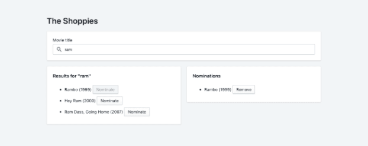

# The Challenge 

Create a webpage that can search OMDB for movies, and allow the user to save their favorite films they feel should be up for nomination. When they've selected 5 nominees they should be notified they're finished.

## Requirements 

- Simple to use interface.
- The ability to search the OMDB API and return a list of movies that show at least the title, release year, and a button to nominate them.
- Search results should only be of movies.
- Updates to the search terms should update the result list.
- If a movie has been nominated already, it's button should be disabled within in search results.
- Nominated movies should move to their own "Nomination List".
- Movies in the nomination list should be able to be removed.
- Display a banner when the user has 5 nominations.

### Provided Reference Image 



Example of one of the people who tried this: [Live example](https://the-shoppies-gyk.netlify.app/)

# Instructions: 

## File structure

- depending on what flow to take
    - Follow the component container pattern, so your two main folders inside the `src` will be the `components` folder that will contain your components and `containers` that will contain container components. *You can read more about container components [here](https://reactpatterns.com/#container-component) or you can ask you team leader about it for more clarity.*
    - similar concept you can use the component page 
    take a look [here](https://blog.bitsrc.io/structuring-a-react-project-a-definitive-guide-ac9a754df5eb)

- Use `scss` instead of css if you going with `react-bootstrap`
- You can use `postcss` if you are going with another library that uses something like `tailwind`
- Global style variables will be inside a `style` folder inside the `src` inside a `_variables.scss.` If you are using `react-bootstrap` this can come in handy!
- The main folder names inside the `src` should be lower case like `components` and `container or pages` other folders inside them should be TitleCase like `ProgressBar` and files inside these folder will be TitleCase too like `ProgressBar.js.` If you need styles then add them with the same `.js` file name like `ProgressBar.scss`

Your project hierarchy should look something similar to this:

```
.
├── src
	├── components
		├── ProgressBar
			├── ProgressBar.js
			├── ProgressBar.scss
	├── containers
		├── About
				├── ContactForm.js
				├── About.js
	├── style
		├── _variables.scss
```

- All dependencies inside the `package.json` should be used in the project.
- It's recommended to use Yarn to install the packages.
- General use images should be inside a folder inside `src` under `images` and try to use `svg` as much as possible. Component specific images should be under their folders.

## Software requirements:

- You should have prettier installed and make sure your code is well formatted before committing it.
- You should have eslint installed and make sure your code is following the [Airbnb guidelines](https://github.com/airbnb/javascript/tree/master/react) before committing.
- You should install [Husky](https://github.com/typicode/husky) to make sure that your code gets checked before you commit anything. 
- For Styling use Tailwind, Styled Components, React-Bootstrap, or Material UI.
- Follow the [Git feature branch workflow](https://www.atlassian.com/git/tutorials/comparing-workflows/feature-branch-workflow)
- Follow the [Angular commit message format](https://github.com/angular/angular/blob/master/CONTRIBUTING.md#-commit-message-format)
- This project should be deployed to [Vercel](https://vercel.com/) or [Netlify](https://www.netlify.com/)

[Helpful article about prettier and eslint](https://www.mkapica.com/react-eslint/)

### Scripts

This project was created using `create-react-app` and `yarn` as the package manager.


